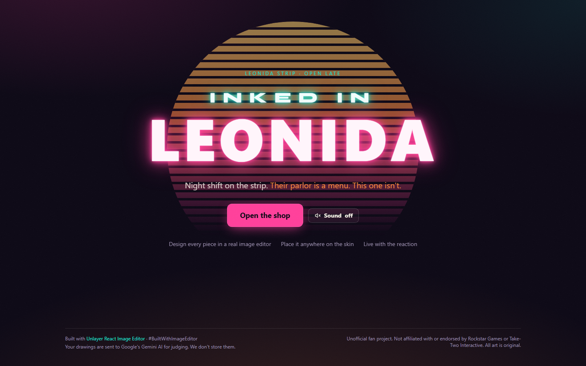

# Inked in Leonida

**Night shift on the strip. Their parlor is a menu. This one isn't.**

A neon tattoo-parlor game: you're the night-shift artist in a shop on the Leonida strip. Clients walk in with orders. You design every piece yourself in Unlayer's React Image Editor, place it anywhere on their skin, and live with the reaction. On night 2, one of them comes back, and you have to cover up your own tattoo.

**Play it live: https://inked-in-leonida.vercel.app** (desktop recommended; a full shift takes about 4-6 minutes)



Built for the Unlayer **#BuiltWithImageEditor** challenge.

---

## Why

Players keep asking open-world games for the same three things:

1. **Design your own ink**, not pick from a catalog: every piece here is drawn in a real image editor.
2. **Lettering**: most orders need exact text, so Script (the Text tool) is a hero tool.
3. **Free placement**, not fixed slots: drag, scale and rotate anywhere on the skin.

## How to play

- **Open the shop.** Read the order: motif, exact lettering, required colors, zone and size.
- **Draw the stencil** in the editor (Needle, Script, Stencil, Flash, Ink Age, Trim), then hit **Transfer Stencil**.
- **Place it** anywhere on the arm, shoulder or back. Drag it, resize it, rotate it, then **Lock it in**. The needle sweeps the ink into the skin.
- **Get judged.** The client reacts, and you get a score breakdown, stars and a tip. Post it to **InkGram**, download the 1080x1350 card, or share it on X.
- **Night 2:** Tino is back. The editor opens on **your own night-1 stencil**, and you have to cover CRYSTAL up. Then the last chair is yours: ink yourself, with every tool unlocked, and see your whole shift on the **shop wall**.

## How React Image Editor is used

The editor is the only place the player makes pixels. Everything downstream (placement, compositing, scoring, the share card) works on the editor's output.

| Integration point | What we do with it | Where |
|---|---|---|
| `<ImageEditor>` component | Each client gets a fresh editor (the `<InkEditor>` wrapper is keyed by `job.id`), and a power-out Retry remounts it (`key={attempt}`). Props: `image`, `options`, `minHeight`, `scriptUrl`, `onLoad`, `onSave`, `onLoadError`, `onError`, `ref`. | [`src/components/studio/InkEditor.tsx#L169`](src/components/studio/InkEditor.tsx#L169), [`StudioScreen.tsx#L89`](src/components/studio/StudioScreen.tsx#L89) |
| Per-job `features.imageEditor.tools` | Each job gets its own tool config. Resize and Frame are off for client work (they make no sense on skin). **Crop is off for the cover-up**, because concealment compares pixels at the same coordinates. The self-ink finale unlocks all 8 tools as a reward. | [`src/lib/editorConfig.ts#L8`](src/lib/editorConfig.ts#L8) |
| `options.translations` | Themed rail labels (Draw → **Needle**, Text → **Script**, Stickers → **Flash**, Shapes → **Stencil**, Filter → **Ink Age**, Crop → **Trim**, Frame → **Border**). The toolbar Save button reads **Transfer Stencil**. The keys were verified in the installed package's `intl.d.ts`, and each label is 8 characters or less so none are truncated. | [`src/lib/editorConfig.ts#L16`](src/lib/editorConfig.ts#L16), [`#L30`](src/lib/editorConfig.ts#L30) |
| `options.theme` | `"dark"`, to match the night shop. | [`src/lib/editorConfig.ts#L29`](src/lib/editorConfig.ts#L29) |
| AI Assistant off | `features.ai: false` and `aiAssistantOpenState: "closed"`, with no `projectId` (a unit test enforces this). | [`src/lib/editorConfig.ts#L32`](src/lib/editorConfig.ts#L32), [`src/lib/__tests__/editorConfig.test.ts`](src/lib/__tests__/editorConfig.test.ts) |
| `image` start states | Client jobs and the finale start on blank 1024x1024 stencil paper, converted to a data URL. The **cover-up starts on the exact raw editor output saved from night 1** (JPEG from Save or PNG from `getImage()`), untouched. Verified pixel-identical (max diff 0) in both formats. | [`src/components/studio/StudioScreen.tsx#L25`](src/components/studio/StudioScreen.tsx#L25) |
| `onSave({ dataUrl })` pipeline | The editor's own **Transfer Stencil** button hands the stencil to the game. An ink check refuses empty paper, and a pixel-diff check refuses an untouched cover-up ("That still says CRYSTAL."). | [`src/components/studio/InkEditor.tsx#L183`](src/components/studio/InkEditor.tsx#L183), [`#L64`](src/components/studio/InkEditor.tsx#L64) |
| `ref.current.editor.hasChanges()` guard | Our own "Transfer stencil" button refuses an unchanged stencil (the client stares at you and the button shakes). | [`src/components/studio/InkEditor.tsx#L83`](src/components/studio/InkEditor.tsx#L83) |
| `ref.current.editor.getImage()` | The second transfer path, used when the guard passes. | [`src/components/studio/InkEditor.tsx#L84`](src/components/studio/InkEditor.tsx#L84) |
| `ref.current.editor.reset(startImage)` | The "Stencil paper jammed" **Retry** reloads the start image in place, and remounts if there's no instance or the reset fails. | [`src/components/studio/InkEditor.tsx#L100`](src/components/studio/InkEditor.tsx#L100) |
| `onLoadError` | Shows an in-world "Stencil paper jammed" toast with Retry (and Restart shift, so it's never a dead end). | [`src/components/studio/InkEditor.tsx#L184`](src/components/studio/InkEditor.tsx#L184) |
| `onError` + load timeout | If the embed script fails or `onLoad` never fires within 15 s, the player sees **"POWER'S OUT AT THE SHOP"** with Retry. Retry remounts with a fresh `scriptUrl`, and the rest of the shop stays usable. | [`src/components/studio/InkEditor.tsx#L188`](src/components/studio/InkEditor.tsx#L188), timer [`#L45`](src/components/studio/InkEditor.tsx#L45), screen [`#L107`](src/components/studio/InkEditor.tsx#L107) |
| `onLoad(editor)` | Stores the instance for our Transfer button, and keeps Transfer disabled until the editor is ready. | [`src/components/studio/InkEditor.tsx#L176`](src/components/studio/InkEditor.tsx#L176) |

Editor facts we verified against the installed package and the live CDN build (full notes in [`NOTES.md`](NOTES.md)):

- Opaque stencils save as JPEG.
- `hasChanges()` reads `false` inside `onSave`.
- An unapplied crop is committed by Save but not by `getImage()`.

## The ink pipeline

All scoring math is in pure functions under [`src/lib/ink/`](src/lib/ink/), with 100+ Vitest tests (226 in total).

**Composite path** (what you see on the skin):

1. **`whiteToAlpha()`** on the raw full-resolution editor output: strips the white stencil paper to transparent by luminance. It never strips saturated light colors (pastel pink survives), and it's tolerant of JPEG ringing. [`alpha.ts#L15`](src/lib/ink/alpha.ts#L15)
2. **Placement**: the stencil gets the player's center, scale and rotation. The zone hit is tested on that center.
3. **Multiply composite** (the same function drives the live preview and the final output):
   - The ink layer is blurred 0.4 px and clipped to the body's alpha with `destination-in`.
   - It's then **multiplied** into the skin at 0.92 alpha, so it looks like ink, not a sticker. [`composite.ts#L48`](src/lib/ink/composite.ts#L48)
4. **INKING**: a 2.5 s reveal sweep with a needle dot leading the edge, then a 1 s fresh-ink halo. It's skipped under `prefers-reduced-motion`.

**Analysis path** (what gets scored):

- **`normalize()`** makes a 512x512 copy letterboxed on white. The old (night 1) and new (cover-up) stencils go through this same function. [`dom.ts#L43`](src/lib/ink/dom.ts#L43)
- From there: the ink mask, coverage, color shares, `concealment()` for the cover-up, and the 512px JPEGs for the judge.

### Scoring

**Client jobs (Tino, Kaylee), 100 points** ([`score.ts#L46`](src/lib/ink/score.ts#L46))

| Part | Points | Rule |
|---|---|---|
| Palette | 25 | Each required color with at least a 5% ink share earns an equal slice. A forbidden color over 10% costs 10. |
| Size | 15 | Full points inside the ordered coverage range, with a linear falloff outside it. |
| Placement | 10 | The ink's center is inside the target zone. |
| Motif | 25 | Vision judge. With no judge, it's 15. |
| Lettering | 25 | Vision judge reads the stencil: 25 if it matches, 10 if the text is readable but wrong. With no judge, it's 15. |

**Cover-up (Tino, night 2), 100 points** ([`score.ts#L67`](src/lib/ink/score.ts#L67), [`concealment.ts#L25`](src/lib/ink/concealment.ts#L25))

| Part | Points | Rule |
|---|---|---|
| Cover-up | 40 | Share of old ink no longer visible: 0 points at 50% hidden or less, rising linearly to full points at 90%. An old pixel counts as "visible" if it kept its color **and** its outline still stands out, so painting solid black over black letters really hides them. |
| Old name gone | 20 | Vision judge: is "CRYSTAL" still readable? With no judge: concealment of at least 85%. |
| Palette | 15 | At least 25% black. |
| Motif | 25 | Panther, skull, storm or lightning (vision). With no judge, it's 15. |

- **Stars:** 90+ gets 5, 75+ gets 4, 55+ gets 3, 35+ gets 2, anything lower gets 1.
- **Tip:** base pay × stars / 5, rounded to $5.
- **Offensive:** if the judge flags a design as offensive, it scores 0, gets 1 star and no tip, and the client asks you to start over.

The vision judge (Gemini) supplies motif, lettering and the client's reaction line. If it's unavailable or slow (over 9 s), the game falls back to canned lines and a "Client squinted at it." tag, so it's always fully playable. The self-ink finale is never judged.

## Run locally

```bash
npm install
npm run dev        # http://localhost:3000
npm run test       # Vitest (pure functions)
npm run typecheck
npm run lint
npm run build
```

The editor loads from Unlayer's CDN, so it needs a network connection.

**Environment variables** (all optional; the game is fully playable without them):

| Variable | Purpose |
|---|---|
| `GEMINI_API_KEY` | Enables the vision judge. Server-only: it's sent in a request header and never reaches the browser bundle. |
| `GEMINI_MODEL` | Defaults to `gemini-3.5-flash-lite`. |
| `GEMINI_THINKING_LEVEL` | Defaults to `minimal`. |

Put them in `.env.local` (gitignored). Without a key, `/api/judge` returns the fallback and the canned lines take over.

## Privacy

**Your drawings are sent to Google's Gemini AI for judging. We don't store them.**

- Each judged tattoo sends two 512px JPEGs (the stencil and the tattoo on skin) to Google's Gemini API.
- The game keeps no copy on the server, apart from a short-lived in-memory cache on each server instance. There are no accounts and no database.
- On Gemini's free tier, Google may use inputs to improve its products.
- The self-ink finale is never sent anywhere.
- The shop wall is saved only in your own browser (`localStorage`).

## Credits

- Design, code and all art: original. The body art is procedurally generated.
- Fonts: [Syne](https://fonts.google.com/specimen/Syne), [Space Grotesk](https://fonts.google.com/specimen/Space+Grotesk) and [Pirata One](https://fonts.google.com/specimen/Pirata+One) (Google Fonts). Sound is synthesized with the Web Audio API, with no audio files.
- Stack: Next.js 15, TypeScript, Tailwind CSS v4, zustand, Vitest, deployed on Vercel.

Unofficial fan project. Not affiliated with or endorsed by Rockstar Games or Take-Two Interactive. All art is original. Built with Unlayer React Image Editor. #BuiltWithImageEditor
